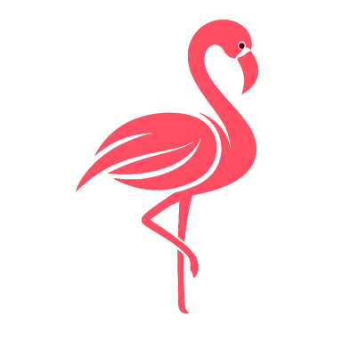

  

# Discover Project

**Discover Project** è un’iniziativa dedicata all’innovazione tecnologica e alla sostenibilità delle aree naturalistiche e turistiche, con un focus particolare sul monitoraggio ambientale, l’eco-turismo e le tecnologie immersive.

## 🌍 Descrizione

Il progetto si propone di combinare tecnologie all’avanguardia come IoT, Digital Twin, Intelligenza Artificiale e Realtà Aumentata per:

- monitorare la sostenibilità ambientale e la biodiversità;
- favorire la partecipazione attiva dei cittadini attraverso pratiche di *citizen science*;
- promuovere percorsi di eco-turismo e sensibilizzazione sul valore naturale delle aree di interesse.

Il progetto si insidia principalmente nel **Parco Regionale del Delta del Po**, un contesto naturalistico di grande rilevanza nazionale e internazionale.

## 🧠 Obiettivi

I principali obiettivi di Discover Project sono:

- 📊 Sviluppare un *Digital Twin* per aree naturali, al fine di analizzare e predire scenari futuri di biodiversità e cambiamenti climatici.
- 🧪 Integrare dati eterogenei raccolti da sensori, algoritmi AI e contributi dei cittadini.
- 🧭 Offrire servizi digitali e interattivi per aumentare la consapevolezza del pubblico su sostenibilità, biodiversità ed eco-turismo.

## 🛠️ Tecnologie

Il progetto combina diverse tecnologie come:

- Sensori ambientali e *smart objects* per la raccolta dati;
- Sistemi di *Digital Twin* e machine learning per l’analisi e la predizione;
- Realtà aumentata e strumenti immersivi per la fruizione dei dati da parte di cittadini e stakeholder.

## 📈 Risultati Attesi

Discover Project mira a:

- creare un sistema digitale di supporto alle decisioni;
- fornire dati utili a istituzioni e cittadini;
- promuovere la sostenibilità e lo sviluppo di servizi innovativi in contesti naturali.
## 📬 Contatti

Per informazioni sul progetto e collaborazioni:

- 📧 Email: `info@discover-project.it`  
  
---

*Discover Project è realizzato grazie ai fondi europei della Regione Emilia-Romagna.*